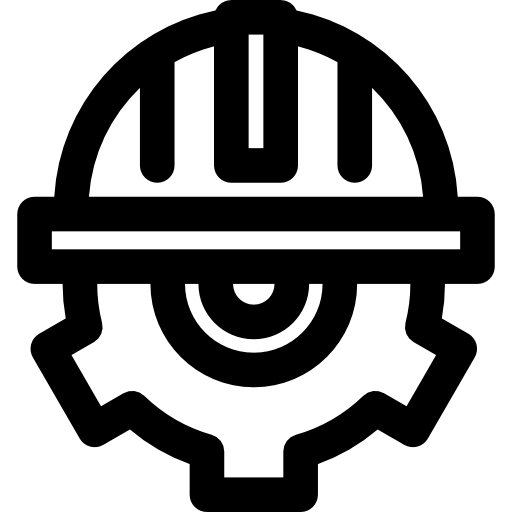

           
***
---

### 
Hello, World !

## 
I'm Waldemar Weis

 ####  
About Me

  

-  &nbsp;&nbsp;&nbsp;&nbsp; I’m currently working on Schneider Electric AG ( Switzerland).

- &nbsp;&nbsp;&nbsp;  I'm studying to be a Full-Stack Web Developer.

-   &nbsp;&nbsp;&nbsp;&nbsp;I speak German, English, Russian.

- &nbsp;&nbsp;&nbsp;&nbsp; What do I like to do in my free time?
   - 
&nbsp;&nbsp;I like taking photos.

   - 
&nbsp;&nbsp;Play guitar and piano.

   - 
&nbsp;&nbsp;Paragliding, Ski and snowboarding.

   - 
&nbsp;&nbsp;I like to develop myself and read useful literature.

   
- &nbsp;&nbsp;&nbsp;&nbsp; How to reach me: w.weis@hotmail.com

---

#### 
Programming languages and Tools

 

&nbsp;&nbsp;&nbsp;&nbsp;
&nbsp;&nbsp;&nbsp;&nbsp;
&nbsp;&nbsp;&nbsp;&nbsp;
&nbsp;&nbsp;&nbsp;&nbsp;
&nbsp;&nbsp;&nbsp;&nbsp;
&nbsp;&nbsp;&nbsp;&nbsp;
&nbsp;&nbsp;&nbsp;&nbsp;
&nbsp;&nbsp;&nbsp;&nbsp;

---

    

#### 
My stat

 

---

 

  &nbsp;&nbsp;&nbsp;&nbsp;
  &nbsp;&nbsp;&nbsp;&nbsp;
  

---
---
